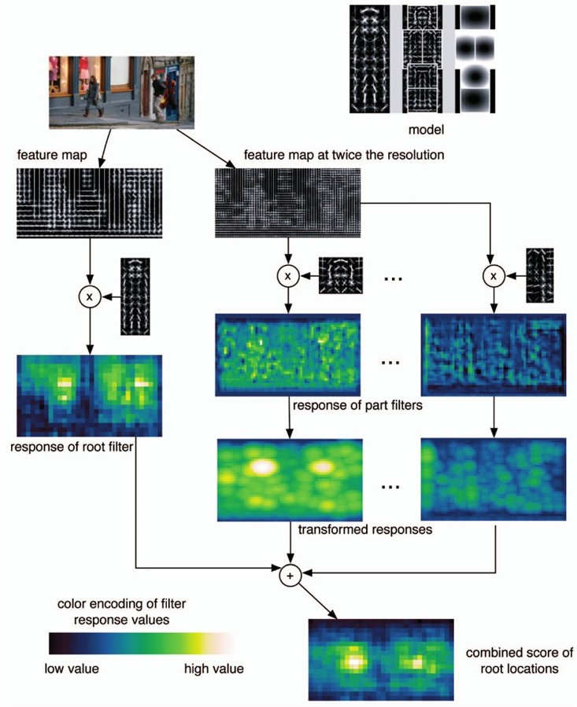

# DPM（Deformable Part Model）

> 可变形的组件模型，是一种基于组件的检测算法。

* DPM可以看作是HOG的扩展：先计算梯度方向直方图，然后利用SVM训练得到物体的梯度模型。

## 算法思想

输入一幅图像，对图像提取图像特征，针对某个物件制作出相应的激励模板，在原始的图像上滑动计算得到该激励效果图，根据激励的分布确定目标位置。

制作激励模板就相当于人为地设计一个复杂的卷积核，拿这个卷积核与原图像进行卷积运算得到一幅特征图。
比如拿一个静止站立的人的HOG特征形成的卷积核，与原图像的梯度图像进行一个卷积运算，那么目标区域就会被变密。

测试流程图：

## 算法步骤

1. 产生多个模板：整体模板以及不同的局部模板。

2. 使用这些不同的模板分别和输入图像进行卷积产生特征图。

3. 将上一步得到的特征图组合形成融合特征。

4. 对融合特征进行传统分类，回归得到目标分类。

## Reference

* [DPM（Deformable Parts Models）-----目标检测算法理解](https://blog.csdn.net/qq_22625309/article/details/72493223)

* [DPM Deformable Parts Model](https://www.jianshu.com/p/e52e98abbf06)

* [DPM(Deformable Parts Model)--原理(一)](https://blog.csdn.net/ttransposition/article/details/12966521)

* [P. Felzenszwalb, D. McAllester, D.Ramanan A Discriminatively Trained, Multiscale, Deformable Part Model IEEEConference on Computer Vision and Pattern Recognition (CVPR), 2008](http://www.rogerioferis.com/VisualRecognitionAndSearch2014/material/papers/DPMCVPR98.pdf)

* [DPM（Deformable Part Model）原理详解](https://blog.csdn.net/qq_14845119/article/details/52625426)

